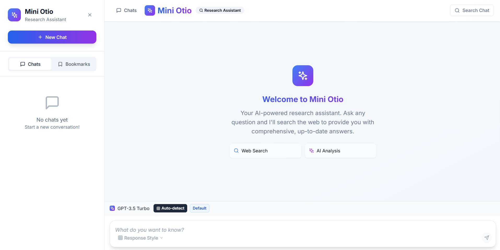

# Mini Otio Research Assistant

A Next.js 15 + TypeScript web application that combines web search with AI-powered responses for research assistance.



## Features

- **Web Search Integration**: Uses Exa.ai API for real-time web search
- **AI-Powered Responses**: Streams responses from OpenRouter API
- **Multiple Response Styles**: Default, step-by-step, bullet summary, and "explain like I'm 5"
- **Real-time Streaming**: Token-by-token response streaming
- **Modern UI**: Built with shadcn/ui and Tailwind CSS
- **State Management**: Zustand for global state
- **Input Validation**: Zod schemas for type-safe validation

## Tech Stack

- **Next.js 15** with App Router
- **TypeScript** for type safety
- **shadcn/ui** for UI components
- **Tailwind CSS** for styling
- **Zustand** for state management
- **Zod** for validation
- **Exa.ai API** for web search
- **OpenRouter API** for LLM streaming

## Setup

1. **Install dependencies**:

   ```bash
   npm install
   ```

2. **Set up environment variables**:
   Create a `.env` file in the root directory:

   ```env
   EXA_API_KEY=your_exa_api_key_here
   OPENROUTER_API_KEY=your_openrouter_api_key_here
   ```

3. **Get API keys**:

   - **Exa.ai**: Sign up at [exa.ai](https://exa.ai) for free credits
   - **OpenRouter**: Sign up at [openrouter.ai](https://openrouter.ai) for API access

4. **Run the development server**:

   ```bash
   npm run dev
   ```

5. **Open your browser**:
   Navigate to [http://localhost:3000](http://localhost:3000)

## Usage

1. **Ask a research question** in the text area
2. **Select a response style** from the dropdown:
   - Default: Comprehensive response
   - Step-by-step: Numbered steps
   - Bullet Summary: Key points
   - Explain Like I'm 5: Simple explanation
3. **Click submit** to start the research process
4. **Watch the response stream** in real-time
5. **Generate questions** related to context
6. **Copy responses** or individual highlights
7. **Manage bookmarks** in the sidebar

## Project Structure

```
├── app/
│   ├── api/
│   │   ├── search/route.ts      # Exa.ai search endpoint
│   │   └── stream/route.ts      # OpenRouter streaming endpoint
│   ├── globals.css              # Global styles
│   ├── layout.tsx               # Root layout
│   └── page.tsx                 # Main page
├── components/
│   ├── ui/                      # shadcn/ui components
│   ├── Chat.tsx                 # Chat interface
│   ├── InputBox.tsx             # Input form
│   ├── HighlightsSidebar.tsx    # Highlights management
│   └── TypingIndicator.tsx      # Loading animation
├── lib/
│   ├── api.ts                   # API wrapper functions
│   ├── store.ts                 # Zustand store
│   ├── utils.ts                 # Utility functions
│   └── validators.ts            # Zod schemas
└── package.json
```

## API Integration

### Exa.ai Search

- Searches the web for relevant information
- Returns structured results with titles, URLs, and content
- Used to provide context for AI responses

### OpenRouter Streaming

- Streams AI responses token-by-token
- Uses GPT-3.5-turbo model
- Combines user query with web search context

### Handling Streaming and Prompt logic

User Query → Web Search → Context Preparation → AI Generation → Streaming Response

Step-by-step:

- User Input: User types question in InputBox.tsx
- Search Trigger: Chat.tsx calls searchWithExa()
- Web Search: /api/search → Exa.ai API → Neural web search
- Context Formatting: formatSearchContext() creates structured context
- AI Processing: /api/stream → OpenRouter API with context + query
- Streaming Response: GPT-3.5-turbo streams tokens back
- UI Updates: Real-time display with source citations

### What worked Well

- Streaming Implementation: Robust token-by-token streaming with proper error handling
- API Integration: Clean separation between Exa.ai search and OpenRouter streaming
- State Management: Zustand provides excellent state persistence and management
- UI/UX: Modern, responsive design with great user experience
- Type Safety: Full TypeScript implementation with Zod validation
- Error Handling: Comprehensive error handling throughout the application

### Challenges Faced

- Streaming Complexity: Managing multiple streaming formats (AI SDK UI vs original format)
- State Synchronization: Keeping UI in sync with streaming responses
- API Rate Limits: Managing Exa.ai and OpenRouter API limits
- Timeout Handling: Ensuring streams complete properly with 30-second timeouts


### Suggestions for Otio

- UI is smooth and easy to use.
- As of now we have allowed for singel user, we can add a new feature for teams

## Development

- **TypeScript**: Full type safety throughout the application
- **ESLint**: Code linting and formatting
- **Tailwind CSS**: Utility-first CSS framework
- **Responsive Design**: Works on desktop and mobile devices
